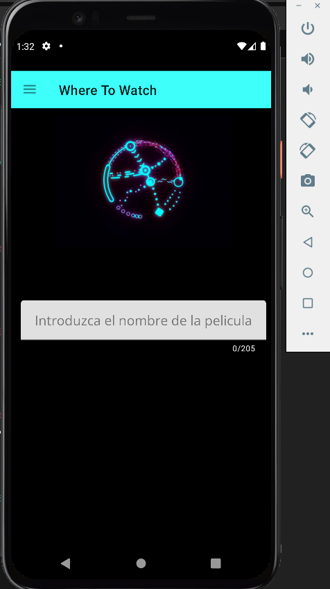
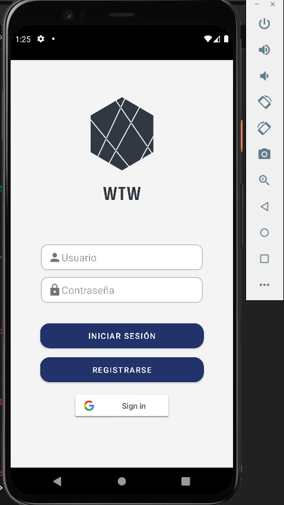
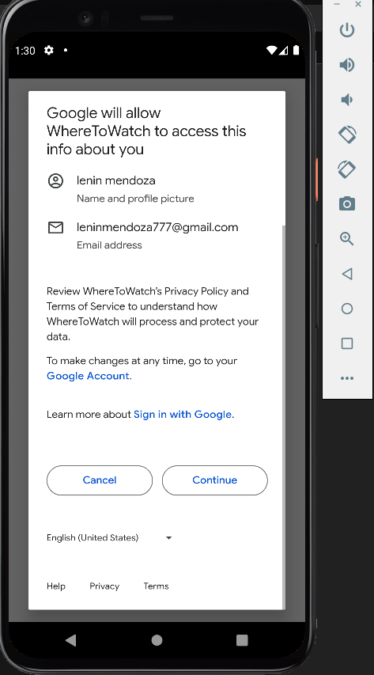
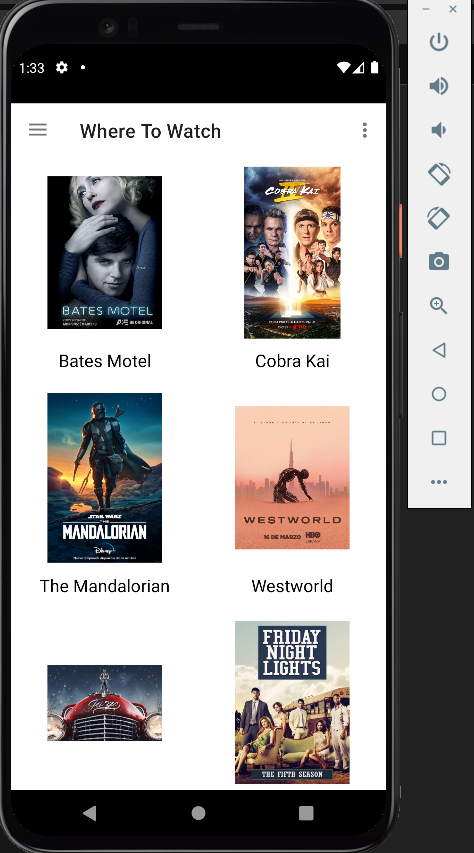
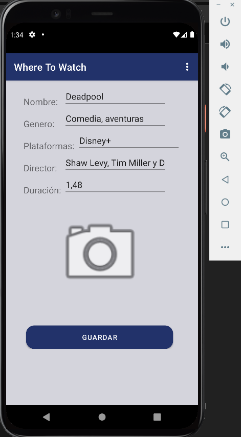
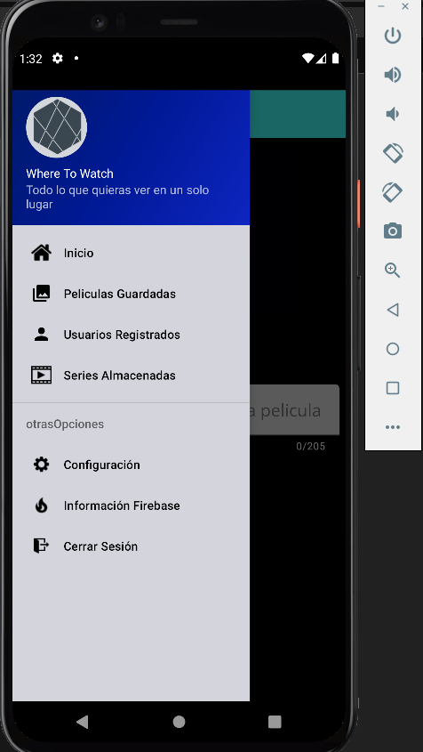

# Where To Watch 📺🍿

**Where To Watch** es una aplicación Android diseñada para ayudarte a gestionar y organizar lo que quieres ver. Con esta app puedes registrarte, iniciar sesión y gestionar una lista de películas y series, utilizando tanto un sistema de autenticación local como la integración con Google (Firebase).

---

## Índice
- [Características](#características-✨)
- [Tecnologías usadas](#tecnologías-usadas-🚀)
- [Demostración](#demostración-🎞️)
- [Instalación](#instalación-y-uso-🔧)
- [Estructura del proyecto](#estructura-del-proyecto-📁)
- [Licencia](#licencia-📜)
- [Contacto](#contacto-🧑🏽‍💻)

---

## Características  ✨

- **Inicio de Sesión y Registro:**
  - Inicia sesión mediante usuario/contraseña.
  - Autenticación con Google (Firebase).
  - Registro de nuevos usuarios con validación de campos.

- **Gestión de Contenido:**
  - Visualiza la lista de películas guardadas.
  - Agrega, edita y elimina películas desde una base de datos SQLite.
  - Muestra detalles de cada película (nombre, género, plataforma, director y duración).
  - Gestión de series y usuarios registrados.

- **Configuración de Cuenta:**
  - Permite al usuario editar sus datos o eliminar su cuenta.
  - Navegación a través de un menú lateral (Navigation Drawer) que facilita el acceso a las diferentes secciones de la app.

- **Interfaz de Usuario:**
  - Splash screen de bienvenida.
  - Diseño consistente y temas para modo claro y oscuro.
  - Uso de ConstraintLayout y NavigationView para una experiencia moderna y adaptable.

---

## Tecnologías Utilizadas 🚀

- **Lenguaje:** Java  
- **Plataforma:** Android Studio, Material Components, NavigationView  
- **Datos:** SQLite (local)  
- **Autenticación:** Firebase Authentication + Google Sign-In  
- **Imágenes:** Glide / Picasso  

---

## Demostración 🎞️

| Pantalla | Descripción |
|----------|-------------|
|  | **Pantalla de bienvenida (Splash)** con GIF animado |
|  | **Inicio de sesión / Registro** con email y contraseña |
|  | Inicio de sesión con **Google** |
|  | **Listado de películas/series** almacenadas en SQLite |
|  | **Formulario** para editar contenido |
|  | **Menú lateral** y configuración para eliminar cuenta |

---

## Instalación y Uso 🔧

1. **Clonar el Repositorio:**

   ```bash
   git clone https://github.com/tu_usuario/where-to-watch.git
   ```
2. **Abrir el Proyecto en Android Studio:**
    - Abre Android Studio y selecciona **Open an existing Android Studio project**.
    - Navega hasta la carpeta donde clonaste el repositorio y ábrelo.
3. **Configuración de Firebase:**
    - Asegúrate de tener el archivo ```google-services.json``` en la carpeta ```app/.```
    - Revisa el archivo ```values.xml``` para ver las configuraciones de Firebase.
4. **Configuración de Datos Sensibles:**
    - Si es necesario, crea un archivo ```secrets.properties``` en la raíz del proyecto con claves de API o URLs privadas. Por ejemplo:

        ```properties
        API_KEY=your_api_key_here
        URL_SERVIDOR=https://your-server-url.com
        ```
    - Asegúrate de que este archivo esté incluido en el ```.gitignore```.

5. **Compilar y Ejecutar:**

    - Conecta un dispositivo Android o configura un emulador.
    - Compila y ejecuta la app desde Android Studio.

## Estructura del Proyecto 📁

- **app/src/main/java/com/example/wheresee:**
Contiene las clases principales de la aplicación, incluyendo las actividades (SplashActivity, MainUser, ActivityConfig, etc.), clases de modelo (Usuario, Series, Peliculas) y la lógica de base de datos (DBHelper).

- **app/src/main/res:**
Contiene los layouts, recursos de colores, strings y estilos utilizados para el diseño de la interfaz.

- **secrets.properties:**
Archivo para almacenar datos sensibles (no se sube a GitHub).

- **.gitignore:**
Configuración para evitar subir archivos locales y sensibles.

## Mejoras Futuras 🔮
- Validación de Datos:
Implementar validaciones más robustas en el registro y en el inicio de sesión para evitar campos vacíos o datos erróneos.

- Sincronización en la Nube:
Expandir la integración con Firebase para sincronizar películas y series entre dispositivos.

- Pruebas Unitarias:
Agregar pruebas unitarias para la lógica de la base de datos y otros componentes críticos.

- Optimización de la UI/UX:
Mejorar la responsividad y la experiencia de usuario, adaptando la interfaz a diferentes tamaños de pantalla.

- Mejoras en Seguridad:
Asegurarse de que se gestionen adecuadamente los datos sensibles, utilizando ```secrets.properties``` y actualizando las configuraciones en Firebase según sea necesario.

## License 📜
Este proyecto está licenciado bajo la [MIT License](LICENSE).

## Contacto 🧑🏽‍💻

* **GitHub:** [AlexanderMenMen](https://github.com/AlexanderMenMen)
* **LinkedIn:** [Alexander Mendoza Mendoza](https://www.linkedin.com/in/alexander-mendoza-mendoza-876255214/)
